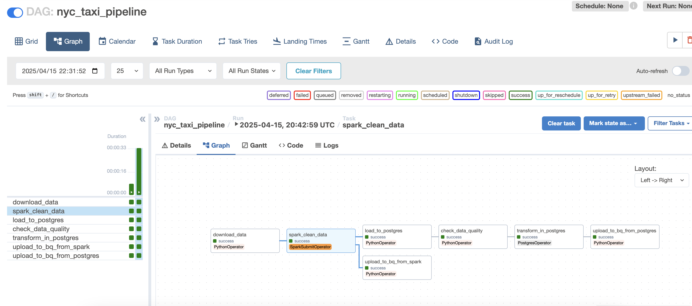

# NYC Taxi Batch Processing Data Architecture

🚖 This project focuses on processing large-scale historical data from NYC Taxi trips to uncover trends related to passenger demand, ride durations, and fare behaviors across geographic and temporal dimensions. The system is architected as a robust batch data pipeline, capable of handling millions of records efficiently while preserving data quality and performance. It combines the scalability of Apache Spark for transformation, the reliability of PostgreSQL for intermediate modeling, and the analytical power of Google BigQuery for downstream exploration and visualization. Orchestrated through Apache Airflow, the pipeline ensures modularity, reproducibility, and extensibility for evolving analytical needs.

## Project Architecture

The entire data pipeline follows this workflow:

```
Data Ingestion → Spark Preprocessing → PostgreSQL Storage → Data Modeling → BigQuery Sync → Visualization
```

The image shows the Airflow DAG execution graph for the NYC taxi data pipeline:


The image should show the workflow with tasks including:
- download_data
- spark_clean_data
- load_to_postgres
- check_data_quality
- transform_in_postgres
- upload_to_bq_from_spark
- upload_to_bq_from_postgres 

## 🛠️ Technology Stack

- **Apache Airflow**: Workflow orchestration tool
- **Apache Spark**: Distributed data processing engine
- **PostgreSQL**: Relational database used as intermediate storage
- **Google BigQuery**: Cloud data warehouse
- **Docker**: Containerized deployment
- **Python**: Primary programming language
- **Grafana/Looker Studio**: Data visualization tools (optional)

  ## 📂 Project Structure

```
.
├── config/             # Configuration files (cloud credentials, database connection info)
├── dags/               # Airflow DAG definitions (NYC taxi data processing workflow)
├── data/               # Data storage directory (raw and processed data)
├── plugins/            # Airflow plugins (custom Operators, etc.)
├── spark-apps/         # Spark applications (data cleaning and transformation logic)
├── spark-data/         # Spark data files (processing results and temporary data)
├── lab/                # Experimental code (proof of concepts and tests)
├── docker-compose.yaml # Docker configuration (service definitions and dependencies)
├── Dockerfile          # Docker image definition (environment setup)
├── .env                # Environment variables (configuration parameters)
└── README.md           # Project documentation
```

## Installation and Setup

### Prerequisites

- Docker and Docker Compose
- Python 3.8+
- Configured Google Cloud account (for BigQuery access)
- PostgreSQL database (can be deployed via Docker)

### 🚀 Quick Start

1. Clone the repository
   ```bash
   git clone https://github.com/yashwanth08/automated-batch-data-pipeline-nyc.git
   cd automated-batch-data-pipeline-nyc
    ```

2. Configure environment variables
   ```bash
   cp .env.example .env
   # Edit the .env file with your configuration information
   ```

3. Add Google Cloud credential file to the config directory
   - Download the service account key JSON file from Google Cloud Console
   - Place the file in the config/ directory and update the path in the .env file

4. Start the environment
   ```bash
   docker-compose up -d
   ```

5. Access the Airflow Web interface
   ```
   http://localhost:8080
   ```
   Default username and password can be found in the docker-compose.yaml file

## Detailed Pipeline Stages

### 1. Data Ingestion Stage

Using Python's requests library to download raw Parquet data and store it in a predefined path. This task ensures we have fresh monthly data for further processing.

Example code:
```python
def download_data():
    url = "https://data-source.com/path/to/taxi_data.parquet"
    response = requests.get(url)
    with open("/path/to/data/raw_taxi_data.parquet", "wb") as f:
        f.write(response.content)
```

### 2. Preprocessing with Spark

Using SparkSubmitOperator to submit a PySpark job for data cleaning:
- Remove rows with null values
- Standardize datetime formats
- Deduplicate records
- Partition by month or date to allow multiple workers to process independently
- Finally, use coalesce(1) to ensure downstream tasks handle only one file

Example code:
```python
df.dropna() \
  .dropDuplicates() \
  .repartition("year", "month") \
  .write.parquet("/path/to/partitioned/data/")

# Final output as a single CSV file
df.coalesce(1).write.csv("/path/to/output.csv", header=True)
```

### 3. PostgreSQL Storage Stage (Staging Layer)

This stage loads the cleaned data into PostgreSQL, acting as a controlled environment for further SQL transformations before sending the data to BigQuery.

Using chunk-based processing to avoid memory overload and improve performance:
```python
df_iter = pd.read_csv(csv_file, chunksize=chunksize, iterator=True)
while True:
    try:
        chunk = next(df_iter)
        # Clean column names: remove spaces
        chunk.columns = [col.strip() for col in chunk.columns]  
        # Convert strings to datetime
        chunk["tpep_pickup_datetime"] = pd.to_datetime(chunk["tpep_pickup_datetime"], errors="coerce")
        chunk["tpep_dropoff_datetime"] = pd.to_datetime(chunk["tpep_dropoff_datetime"], errors="coerce")
        # Insert data
        chunk.to_sql("table_name", engine, if_exists="append", index=False, method="multi")
    except StopIteration:
        print("All chunks processed. PostgreSQL loading complete!")
        break
```

After uploading large datasets, creating indexes on commonly filtered or joined columns (such as B-Tree indexes):
```sql
CREATE INDEX idx_pickup_datetime ON taxi_data(tpep_pickup_datetime);
```

### 4. Data Modeling Phase

In this stage, we perform data modeling and enrichment:
- Create a main table structure, specifying pickup_date as the partition key
- Create sub-tables
- Use SQL statements with CASE WHEN logic to enrich the dataset

```sql
-- Add time bucket column
ALTER TABLE taxi_data ADD COLUMN time_bucket VARCHAR(20);

-- Populate values using CASE WHEN
UPDATE taxi_data
SET time_bucket = CASE
    WHEN EXTRACT(HOUR FROM tpep_pickup_datetime) BETWEEN 7 AND 10 THEN 'Morning Rush'
    WHEN EXTRACT(HOUR FROM tpep_pickup_datetime) BETWEEN 16 AND 19 THEN 'Evening Rush'
    ELSE 'Other'
END;
```

### 5. BigQuery Synchronization Stage (Warehouse Layer)

Configuring LoadJobConfig to enable schema autodetection and automatically skip header rows during ingestion:

```python
from google.cloud import bigquery

client = bigquery.Client()
job_config = bigquery.LoadJobConfig(
    source_format=bigquery.SourceFormat.CSV,
    skip_leading_rows=1,
    autodetect=True,
)

with open(csv_file, "rb") as source_file:
    load_job = client.load_table_from_file(
        source_file,
        "project.dataset.table",
        job_config=job_config
    )

load_job.result()  # Wait for the job to complete
```

### 6. Visualization Stage (Optional)

Using Grafana or Looker Studio to connect to BigQuery datasets and build dashboards for insights like trip volume, average fare by time buckets, etc.

While this part is optional, it helps validate the entire pipeline by visually checking the processed results.

## Monitoring and Maintenance

The project includes a monitoring layer to track pipeline health, task failures, data anomalies, and performance metrics:

```python
default_args = {
    'owner': 'airflow',
    'email': ['your_email@example.com'],
    'email_on_failure': True,
    'retries': 1,
    'retry_delay': timedelta(minutes=5),
}
```

Additionally, we use:
- Airflow's task logs to analyze execution times
- Spark UI to check stages with high shuffle read/write times and optimize accordingly

## Incremental Loading Mechanism

When the data pipeline runs automatically the next time, the mechanism for uploading new data is incremental loading. This ensures that only new or changed data is processed, improving efficiency and reducing resource consumption.

## 📬 Summary

In summary, this project covers a complete batch processing workflow from ingestion to warehouse loading. It demonstrates hands-on experience with orchestration (Airflow), distributed processing (Spark), relational storage (Postgres), cloud warehouse (BigQuery), and end-to-end pipeline design.

   
